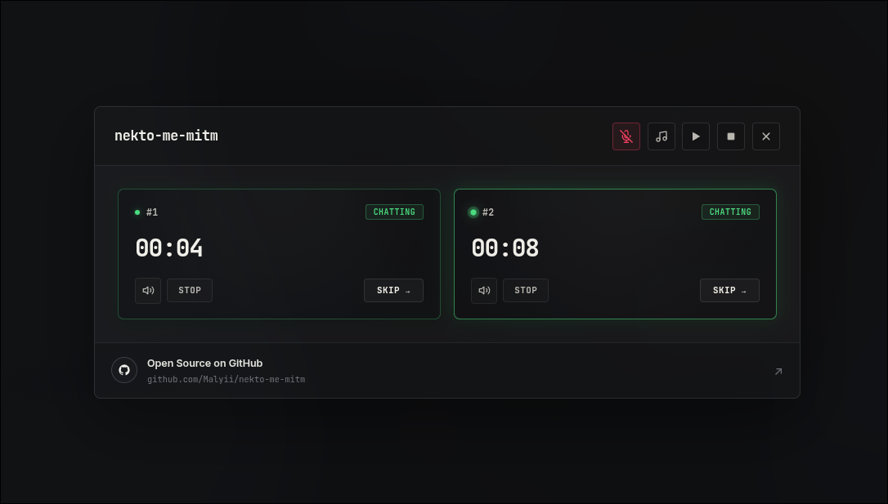
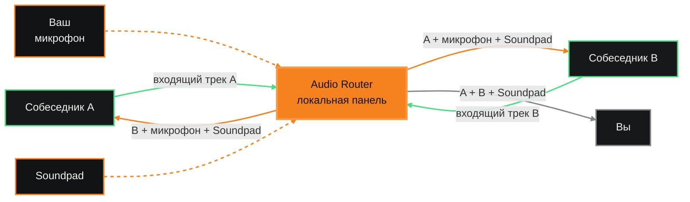

# nekto-me-mitm

Управляйте двумя разговорами Nekto.me из единой панели: переключайте собеседников, используйте Soundpad и включайте свой микрофон в нужный момент.

<p align="center">
  
</p>

## Что такое MITM?

**MITM** (*Man-in-the-Middle*, «человек посередине») означает, что расширение становится посредником между двумя собеседниками: передаёт их голоса друг другу и при необходимости добавляет ваш микрофон и Soundpad.

## Схема аудиомаршрута



## Структура расширения

```text
nekto-me/
├── manifest.json              — конфигурация и порядок загрузки
├── background.js              — вкладки, команды и WebRTC-сигналинг
├── control.html               — панель
├── control.css                — оформление интерфейса
├── control.js                 — управление разговорами и Soundpad
├── modules/
│   ├── fpt.js                 — fingerprint
│   ├── tab-isolation.js       — изоляция вкладок
│   ├── audio-inj.js           — захват и подмена аудиотреков
│   ├── audio-router.js        — маршрутизация и микширование
│   ├── control-inj.js         — управление страницами Nekto.me
│   └── bridge.js              — связь страницы с расширением
├── rules/
│   └── soundpad-network.json  — правила Soundpad
└── docs/
    ├── README.md              — документация проекта
    └── images/                — изображения для README
```
